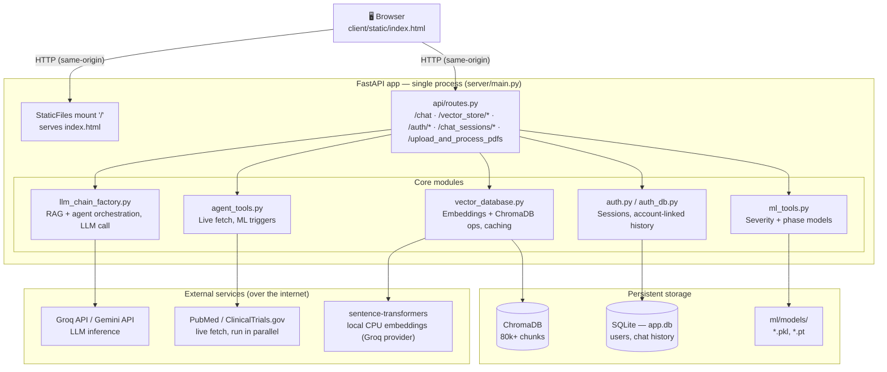

# 🧬 Pharma R&D Assistant

A RAG-powered research assistant for pharma R&D: ask questions and get answers grounded in a local knowledge base of clinical trial records, FDA adverse event reports, and biomedical literature — combined on every query with a live PubMed/ClinicalTrials.gov fetch and two small ML models (adverse-event severity, clinical-trial phase prediction). A FastAPI backend serves both the API and a lightweight static frontend as a single process; optional accounts link chat history across sessions while guests can chat with zero friction.

---

## 🔄 What Changed from the Original Template

| Feature | Version 2 | Version 3 |
|--------|-------------|--------------|
| Codebase | One Streamlit app | Split into `client/` + `server/`, both served by one FastAPI process |
| PDF Upload | In Streamlit | Async FastAPI API |
| Chat | In Streamlit | Calls `/chat` API |
| Vectorstore | In UI | Controlled by backend |
| Model Options | Static | Dynamically fetched |
| Inspector | In sidebar | Main panel toggle |
| Splitting | `RecursiveTextSplitter` | `TokenTextSplitter` |
| UX | Crude | Responsive, clear, downloadable |
| Extendability | Hard | Easy to plug new LLMs, tools |
| Frontend | Streamlit app | Static HTML/CSS/JS, no build step, no separate process |
| Retrieval | Local only | Local vectorstore + live PubMed/ClinicalTrials.gov fetch, always combined |
| ML tooling | None | Adverse-event severity + trial-phase prediction models |
| Accounts | None | Optional login — guests chat with no barrier; logging in links chat history to an account |

---

## 🧪 How It Looks

Two views: **Chat** (ask questions, get grounded answers with an expandable "How I got this answer" trace showing both local and internet sources) and **Inspector** (raw ranked vectorstore chunks with a citation viewer, no LLM involved). Screenshots/demo video for the current UI are TODO — the previous ones here were from the original Streamlit-based template and no longer reflect this app.

---

## 🏗️ Architecture

One FastAPI process serves both the static frontend and the API. Every chat message combines local ChromaDB retrieval with a live PubMed/ClinicalTrials.gov fetch and, when relevant, one of two small ML models — see [IMPLEMENTATION.md](IMPLEMENTATION.md) for the full breakdown.



---

## 🚀 Features

- 📁 Upload multiple documents (PDF, DOCX, CSV, HTML, XLSX, JSON, TXT) and chat with them
- 🔌 Groq as the active LLM provider (Gemini supported in code, currently disabled until its vectorstore is ingested)
- 🌐 Every chat answer combines local retrieval **and** a live PubMed/ClinicalTrials.gov fetch, with clickable references for both
- 🧬 Two small ML models (adverse-event severity, clinical-trial phase prediction) feed into answers when relevant
- 🔎 Query inspector for vectorstore transparency — ranked, scored chunks with a source citation viewer, no LLM involved
- 🧠 RAG with LangChain + ChromaDB
- 📦 Single FastAPI process serves both the static frontend and the API — no separate frontend server
- 🧪 Token-based chunking for LLM precision
- 👤 Optional accounts — guests chat with zero friction; logging in links chat history to your account across sessions
- 💬 Downloadable chat history
- 🧰 Tools for reset, undo, clear (in the Settings menu)
- 🌐 Fully API-driven interaction

---

<details>
  <summary>🛠️ Tech Stack</summary>

- **Frontend**: Static HTML/CSS/vanilla JS (`client/static/index.html`), served directly by FastAPI — no build step, no separate process
- **Backend**: FastAPI
- **LLMs**: Groq & Gemini via LangChain (Gemini currently disabled — see Features)
- **Vector DB**: ChromaDB
- **Embeddings**: HuggingFace & Google GenAI
- **Chunking**: TokenTextSplitter (was RecursiveCharacterTextSplitter)
- **Parsing**: PyPDF, docx2txt, unstructured (HTML/Excel)
- **Orchestration**: LangChain Retrieval Chain
- **ML models**: scikit-learn (severity, Decision Tree) + PyTorch (trial phase, small feed-forward net)
- **Auth/accounts**: stdlib `sqlite3` + `hashlib` (PBKDF2) — no external auth service

</details>

---

## 📦 Installation

```bash
git clone https://github.com/Meghu2002/Pharma-R-D-Assistant.git
cd Pharma-R-D-Assistant
```

Setup Virtual Environment:
```bash
python3 -m venv venv
source venv/bin/activate
```

Install dependencies (one process serves everything, so there's a single requirements file):

```bash
cd server
pip3 install -r requirements.txt
```

---

## 🔐 API Keys Required

- **Groq API key** from [console.groq.com](https://console.groq.com/)
- **Google Gemini API key** from [ai.google.dev](https://ai.google.dev/)

Create a `.env` file:

```env
GROQ_API_KEY=your-groq-key
GOOGLE_API_KEY=your-google-key
```

---

## ▶️ Run the Bot

One process serves both the API and the frontend — no separate frontend server to start.

```bash
cd server
python main.py
# or: uvicorn main:app --reload
```

Then open **http://127.0.0.1:8000/** in a browser.

---

<details>
  <summary>📁 Project Structure</summary>

```bash
Pharma-R-D-Assistant/
├── client/
│   └── static/
│       └── index.html              # The entire frontend: HTML+CSS+JS, no build step

├── server/                         # FastAPI backend — serves the API AND the frontend above
│   ├── api/
│   │   ├── routes.py               # All HTTP endpoints (chat, vectorstore, auth, uploads)
│   │   └── schemas.py              # Pydantic schemas for I/O
│   ├── core/
│   │   ├── document_processor.py   # Upload validation, loading, chunking
│   │   ├── llm_chain_factory.py    # RAG + agent orchestration, LLM calls
│   │   ├── vector_database.py      # Embeddings + ChromaDB ops, caching
│   │   ├── agent_tools.py          # Live PubMed/ClinicalTrials.gov fetch, ML triggers
│   │   ├── ml_tools.py             # Loads/runs the severity + phase prediction models
│   │   ├── auth.py                 # Password hashing, session tokens
│   │   └── auth_db.py              # SQLite: users, sessions, account-linked chat history
│   ├── ml/
│   │   ├── models/                 # Trained model artifacts (.pkl, .pt)
│   │   ├── train_decision_tree.py  # Trains the severity classifier
│   │   └── train_neural_net.py     # Trains the trial-phase classifier
│   ├── config/
│   │   └── settings.py             # Reads .env, model provider config, paths
│   ├── utils/
│   │   └── logger.py               # Logging setup
│   ├── data/                       # Vectorstores + curated data + app.db (gitignored)
│   ├── ingest_data.py              # One-off bulk ingestion script
│   ├── main.py                     # FastAPI app entrypoint
│   ├── requirements.txt
│   └── README.md

├── README.md                       # Root README (overview + instructions)
├── IMPLEMENTATION.md                # Full technical implementation writeup
├── .gitignore
```

</details>

---

<details>
  <summary> 👓 Different Views </summary>

| View | Description |
|------|-------------|
| 💬 Chat | Chat bubbles, suggestions, composer, downloadable history |
| 🔬 Inspector | Ranked/scored vectorstore chunks with a citation viewer, no LLM call |

</details>

---

<details>
  <summary>🧼 Settings Menu</summary>

| Item | Function |
|----------|--------|
| 🔄 Reset session | Clears session state |
| 🧹 Clear Chat | Clears chat + PDF submission |
| ↩️ Undo | Removes last question/response |
| 📥 Export chat history | Downloads the current conversation as CSV |
| 👤 Log in / Sign up | Optional account creation — links chat history to your account |
| ⏻ Logout | Returns to guest mode (local-only history) |

</details>

---

<details>
  <summary>📦 Download Chat History</summary>

Chat history is saved in the session state and can be exported as a CSV with the following columns:

| Question | Answer | Model Provider | Model Name | PDF File | Timestamp |
|----------|--------|----------------|------------|---------------------|-----------|
| What is this PDF about? | This PDF explains... | Groq | llama3-70b-8192 | file1.pdf, file2.pdf | 2025-07-03 21:00:00 |

</details>

---

<details>
  <summary>🙏 Acknowledgements</summary>

- [LangChain](https://www.langchain.com/)
- [FastAPI](https://fastapi.tiangolo.com/)
- [Groq](https://console.groq.com/)
- [Google Gemini](https://ai.google.dev/)
- [Chroma](https://docs.trychroma.com/)

</details>

---

Happy building! 🛠️
